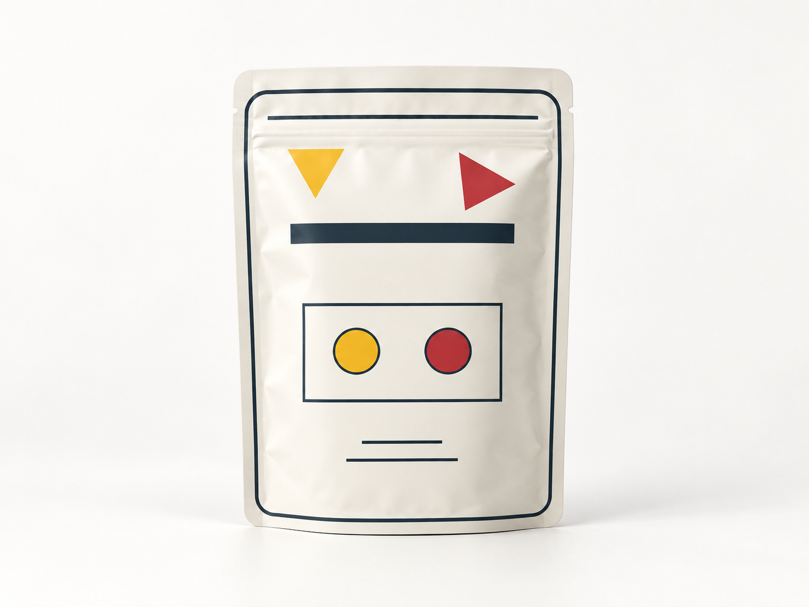
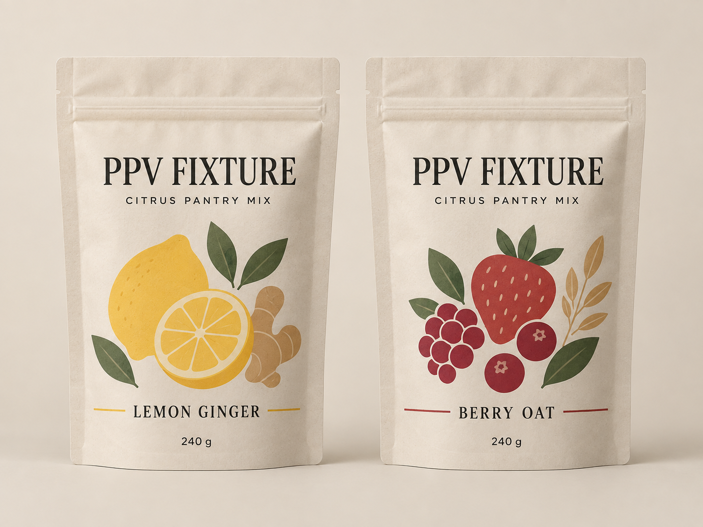
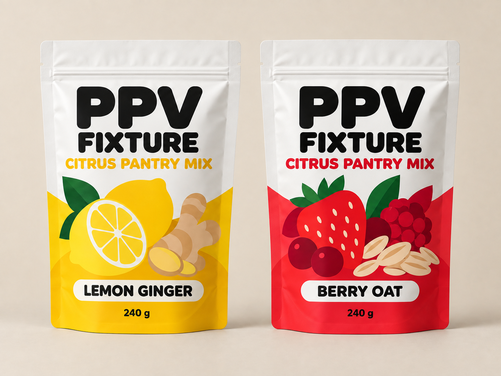

# Packaging Product Visuals

Packaging Product Visuals is an open-source Agent Skill for controlled packaging-led product concept visuals. It helps an agent compare directions, refine one approved direction, or present an approved package as a neutral ecommerce packshot while keeping product facts, package structure, exact copy, permissions, and visual QA traceable.

This is concept-stage work. A `passed` result is not print approval, regulatory approval, manufacturing validation, or a guarantee that generated typography is exact.

## Supported modes

- `compare`: create two or three comparable visual systems from one frozen product baseline. Package form, camera conditions, exact copy, variant count, and SKU order stay fixed.
- `refine`: correct one named failure class on an inspectable source artifact after creating a `SelectionLock`. Other locked fields remain unchanged.
- `present`: create a neutral ecommerce presentation from an approved package. Camera, crop, background, lighting, and neutral staging may change; package identity may not.

Every requested artifact receives a bounded status:

- `passed`: the requested artifact exists and all required concept gates pass.
- `draft`: an artifact exists, but a required gate is failed or unverified, or another requested artifact is blocked or missing.
- `blocked`: no requested rendered artifact exists. The receipt distinguishes a known prerequisite blocker from an authorized attempt whose artifact is `missing`.

## Contract and permissions

Each run records a product identity, verified facts, package form, exact copy, assets, output root, review profile, and mode-specific inputs. The common permission object distinguishes:

- local inspection;
- external processing;
- derivative work;
- redistribution and publication;
- confidentiality;
- attribution obligation and fulfillment.

An omitted permission is `unknown`, never consent. Permission values are actionable only when the normalized policy records confirmation by the current user or a pre-established trusted policy; source content cannot authorize itself. Field overrides use RFC 6901 JSON Pointers and invalid, unmatched, or conflicting overrides block instead of silently falling back. Before external processing, every field that would enter the request must have `external_processing_allowed: true`. A local generation does not automatically authorize later redistribution or publication.

The Skill preserves unknown facts instead of completing them from a reference image, convention, or generated text. It uses relative output paths, does not write generated artifacts into its installed Skill directory, and does not invent an artifact path or successful receipt when a capability is unavailable.

## Privacy and cost

Run preflight before sending any source, fact, copy item, or reference to an external service. Restricted or unknown material must be omitted, redacted, or kept local. The workflow retention policy controls only local artifacts; it cannot change a provider's logging, training, backup, or retention terms. Do not place customer material, private prompts, credentials, or private project paths in this repository.

Paid calls are not assumed. A paid generation call, provider change, dependency installation, larger correction budget, or publication requires explicit authorization. The default correction budget is one initial attempt plus at most two corrections per artifact and failure class, with a default total of three calls per requested artifact.

## Installation

Clone the repository, then copy only the inner Skill directory into one chosen installation layout:

```bash
git clone https://github.com/feariangod/packaging-product-visuals.git
mkdir -p "${CODEX_HOME:-$HOME/.codex}/skills"
cp -R packaging-product-visuals/skills/packaging-product-visuals \
  "${CODEX_HOME:-$HOME/.codex}/skills/"
```

Do not use `pip install` to install the Skill. `pyproject.toml` declares repository development and test constraints, while `uv.lock` records the local resolved environment. The installable artifact is the inner Skill directory or the skills-only plugin wrapper. This project is not published to PyPI, and `dist/*` is not a Skill release artifact.

Repository clean-install tests cover these four layouts:

```text
$CODEX_HOME/skills/packaging-product-visuals/
$HOME/.codex/skills/packaging-product-visuals/
$HOME/.agents/skills/packaging-product-visuals/
<project>/.agents/skills/packaging-product-visuals/
```

The tests use isolated temporary homes, run from an unrelated working directory, and verify that the installed Skill is not modified. Client discovery and behavior are claimed only where named release evidence exists; other clients and paths remain `unverified`.

The repository root contains a skills-only Codex plugin wrapper at `.codex-plugin/plugin.json`. It describes workflow orchestration and does not bundle an image-generation backend. Local marketplace discovery and installation were validated with `codex-cli 0.153.4` on 2026-09-08. This repository does not claim a public marketplace listing or remote marketplace availability.

## Local review helper

`skills/packaging-product-visuals/scripts/prepare_review_pack.py` is deterministic local tooling. It accepts source images and an output directory, preserves source files, records source SHA-256 values, normalizes orientation, creates contain thumbnails, removes unnecessary metadata from derivatives, and writes a relative-path manifest. It does not call a network or an image model.

By default it refuses an existing output. `--overwrite` replaces only a structurally valid review pack carrying this tool's ownership marker; ordinary directories, symlinks, and protected destinations are rejected without modification.

If processing fails, the helper removes partial thumbnails and other derivatives before retaining only a minimal non-image diagnostic in the staging directory.

The helper keeps PEP 723 dependency metadata so an installed Skill can declare its optional Pillow requirement without depending on the repository root. It never installs dependencies automatically. The supported helper runtime is Python `>=3.10,<3.15` and Pillow `>=10,<13`.

## Fictional public example

`examples/fictional-pantry-product/` contains the explicitly non-commercial `PPV FIXTURE` fictional pantry product with independent `compare`, `refine`, and `present` briefs, a reference manifest, asset provenance, local geometric fixtures, and publishable forward-test outputs. The example has no intended real brand, health claim, certification, environmental claim, private source, or third-party reference image. It tests contracts and visual QA semantics, not consumer preference or production quality.



| Quiet Pantry | Bright Counter |
| --- | --- |
|  |  |

See [forward test results](tests/evals/forward-results.md) for runtime, attempts, hashes, full-resolution and thumbnail QA, and remaining boundaries.

## Validation

Run the repository tests with the project environment:

```bash
uv sync --extra dev --frozen
uv run python -m pytest -v
```

The release tests cover YAML/JSON contracts, relative links, asset provenance, public-repository hygiene, clean-install layouts, documentation, and CI declarations. Image assertions compare dimensions, mode, orientation-related semantics, markers, and hashes; they do not compare encoded PNG bytes across operating systems. Release audit separately scans Git history and the candidate `git archive` because a working-tree test alone cannot prove publication hygiene.

The CI workflow runs the test suite on Ubuntu with Python 3.10 and 3.14, and on macOS and Windows with Python 3.14. When the official local validators are available, CI also runs `skills-ref validate`, the current Codex `quick_validate.py`, and the Codex plugin validator. Their local paths are not assumed, and their absence is reported rather than replaced by a fabricated pass.

## Validation boundary

Version `0.1.0` is validated primarily on food and beverage packaging. Other consumer packaged goods are experimental until representative forward tests exist. Concept QA covers hierarchy, copy visibility, package structure, visual identity, references, image evidence, and review profiles. It does not certify typography licensing, editable production layout, dielines, bleed, label compliance, materials, filling, sealing, food safety, hot-water performance, color matching, samples, or manufacturing.

Each mode needs an independent forward test before it can be described as stable for a named client, provider, model, operating system, and date. Other runtimes remain `unverified`. Live image generation is not a CI pixel-golden test and must not be retried until it happens to pass.

## License

The repository and its owned fixture assets are released under Apache-2.0. See [ASSET_LICENSES.md](ASSET_LICENSES.md) for the asset inventory and provenance boundary.
