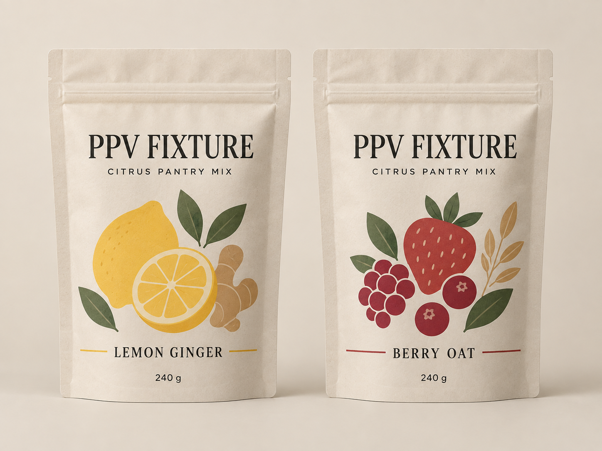
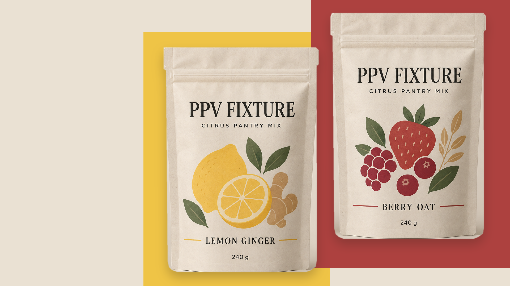

# Packaging Product Visuals

[English](README.md) | [简体中文](README.zh-CN.md)

[](https://github.com/feariangod/packaging-product-visuals/actions/workflows/validate.yml)
[](LICENSE)

Packaging Product Visuals is an Agent Skill for developing a consumer product's packaging and ecommerce images. Start with the category, audience, package construction, and specification. Research the available options, choose a route, then develop packaging concepts and the final image set.

Version `0.2.0` (2026-09-12). The dated examples below document earlier runs, not validation of every current change. A concept image is not approval for print, manufacturing, regulation, or a marketplace listing.

## Workflow

| Step | What you get |
| --- | --- |
| 1. Define the product | A brief covering category, consumer, use, variants, approved copy, initial package construction, and target specification. Unknowns stay visible. |
| 2. Research the options | A visual comparison of same-category packaging, audience aesthetics, construction alternatives, and specification ranges. Recommendations explain their evidence and tradeoffs. |
| 3. Confirm the route | A shared product and package basis for comparing designs. Packaging generation starts after this decision is approved. |
| 4. Compare packaging directions | Usually two or three complete design directions across the requested variants, with the same product facts, structure, copy, and comparison conditions. |
| 5. Select and refine | A refined selected design and reusable source artwork, with its fonts, layout, colors, and package proportions recorded. |
| 6. Plan the ecommerce set | An agreed image list for the channel: each image has a purpose, composition, crop, and approved copy. The buying journey determines the count. |
| 7. Generate and deliver | The agreed images, full-resolution and thumbnail checks, consistency checks across the set, and a list of unresolved production work. |

Start at the first unfinished step. An existing approved package can proceed to ecommerce planning; a request to fix one image does not reopen the entire product brief. The assistant asks only for unresolved decisions that affect the work and continues within the scope already authorized.

## Use the Skill

After installation, invoke it in your assistant:

```text
$packaging-product-visuals
I am developing [product category] for [audience].
Help me compare packaging construction and size options, research the visual
directions, then develop packaging concepts and ecommerce images.
```

Share what you already have: product information, confirmed decisions, package dimensions, copy, or images. You do not need to prepare internal records. The assistant records decisions and open questions as it works.

The Skill does not include an image model or search service. It uses capabilities available in the host assistant and reports missing tools. It does not assume that a particular provider, model, font, or sales channel is available.

## Design and review

Typography is part of the packaging design. Before detailed effects are generated, candidate designs use the real copy at the actual package proportions. Font research follows the design question rather than a fixed quota. Sources, usage rights, character coverage, and the fit between Chinese and Latin lettering must be checked.

Set the comparison checks before generating directions. Cosmetic flaws that cannot affect the choice may be marked for later refinement. Wrong product facts, structure, proportions, required copy, or missing permissions still block selection. Do not reclassify a failed check after seeing the output. The selected direction then receives the stricter delivery review.

Keep the selected artwork for later images. Image generation can create a scene, material, or lighting; real fonts and local composition can preserve exact packaging text. A flat carton workflow does not automatically solve curved bottles or flexible pouches. Review the actual result, including a thumbnail, rather than treating a successful script run as visual approval.

## Public example

Quiet Pantry is a fictional, non-commercial food and beverage packaging example with owned assets. Its dated forward run on 2026-09-09 starts at selection and continues through ecommerce delivery. Earlier product and research records were added retrospectively to describe direction boards made on 2026-09-08. They are not real market research or proof that the full workflow ran in order.

| Catalog | Campaign |
| --- | --- |
|  |  |

This case used all seven supported ecommerce roles to exercise review coverage. Seven images are not a default requirement. The [offline bilingual review page](examples/fictional-pantry-product/review/v0.2/2026-09-09/index.html) shows the images and their recorded review state. The [workflow](examples/fictional-pantry-product/full-workflow.yaml), [delivery manifest](examples/fictional-pantry-product/delivery-manifest.yaml), [QA result](examples/fictional-pantry-product/qa-result-v0.2-2026-09-09.yaml), and [runtime receipt](examples/fictional-pantry-product/runtime-receipt-v0.2-2026-09-09.yaml) preserve the historical evidence.

This example does not establish consumer preference, conversion, or approval for production or a platform. Other categories and environments need their own documented runs. Historical test scope and limitations are listed in the [maintenance guide](docs/maintaining.md#historical-evidence).

## Installation

For a first installation, copy only the inner Skill directory into your assistant's Skill folder:

```bash
git clone https://github.com/feariangod/packaging-product-visuals.git
mkdir -p "${CODEX_HOME:-$HOME/.codex}/skills"
cp -R packaging-product-visuals/skills/packaging-product-visuals \
  "${CODEX_HOME:-$HOME/.codex}/skills/"
```

If an installed copy already exists, compare it with the repository before updating and preserve local changes. Maintain the Skill in `skills/packaging-product-visuals/` in this repository, then sync the installed copy. See [installation updates](docs/maintaining.md#source-and-installation-updates).

The installable artifact is the inner Skill directory or the skills-only wrapper at `.codex-plugin/plugin.json`. Do not use `pip install` to install the Skill. `pyproject.toml` and `uv.lock` are for local development; the project is not published to PyPI, and `dist/*` is not a Skill release artifact. Other installation layouts and dated smoke-test evidence are in the [maintenance guide](docs/maintaining.md).

## Local tools

The [source-bundle helper](skills/packaging-product-visuals/scripts/prepare_package_master.py) keeps declared static artwork, fonts, licenses, and previews together. It checks file hashes and relative dependencies without rendering or uploading anything. It requires Python 3.10 through 3.14 and uses only the standard library. Use `python3` from that environment:

```bash
python3 skills/packaging-product-visuals/scripts/prepare_package_master.py \
  --spec master-spec.json --output package-master
python3 skills/packaging-product-visuals/scripts/prepare_package_master.py \
  --check package-master
```

The output directory must be new. See the [source artwork guide](skills/packaging-product-visuals/references/package-master.md) for the spec. A successful check proves bundle integrity, not correct font rendering, curved-surface mapping, usage rights, visual quality, or production approval.

The [review helper](skills/packaging-product-visuals/scripts/prepare_review_pack.py) creates thumbnails, file hashes, and a bilingual offline review page. It preserves the source files and makes no network or image-model calls:

```bash
uv run python skills/packaging-product-visuals/scripts/prepare_review_pack.py \
  --output review-pack \
  --review-spec review-spec.json \
  source-image.png
```

The helper refuses ordinary existing output directories. It replaces only a valid tool-owned review pack when `--overwrite` is explicit. A review page does not mean its images have passed QA or been approved for publication.

## Safety boundaries

External processing needs permission for the material and its intended use. Missing permission remains `unknown`; a reference image or document cannot grant permission on the user's behalf. Check privacy and provider retention terms before sending material. Do not commit customer files, private prompts, credentials, private paths, or unlicensed references.

Paid calls, provider changes, dependency installation, a larger correction budget, publication, and material scope changes need explicit authorization. Existing authorization remains valid for the scope it covers. The default image budget is one initial attempt and at most two corrections, with at most three calls per requested artifact.

Results use four states: `blocked` for an unmet prerequisite, `missing` when an authorized attempt produced no inspectable image, `draft` when required checks failed or remain `unverified`, and `passed` when every applicable concept check passed. The last state does not certify print, legal, regulatory, manufacturing, supplier, food safety, consumer, conversion, or platform approval. Image models do not guarantee exact typography.

## Development

Run the repository checks in the locked development environment:

```bash
uv sync --extra dev --frozen
uv run python -m pytest -v
uv lock --check
git diff --check
```

Tests cover records, links, public asset provenance, installation layouts, local tools, and documentation. Test results must identify the revision and environment they cover. Automated checks do not replace opening generated images or running a new category through the workflow.

[CONTRIBUTING.md](CONTRIBUTING.md) explains contribution and review requirements. The [maintenance guide](docs/maintaining.md) lists internal records, compatibility rules, and historical evidence. See [SECURITY.md](SECURITY.md) for private vulnerability reporting and [CHANGELOG.md](CHANGELOG.md) for release history. Tags, GitHub Releases, marketplace submissions, external pushes, and publication require explicit approval after release checks pass.

## License

The repository and its owned example assets use Apache-2.0. The [asset inventory](ASSET_LICENSES.md) records their provenance. Third-party fonts and references retain their own terms; check those terms before use or redistribution.
