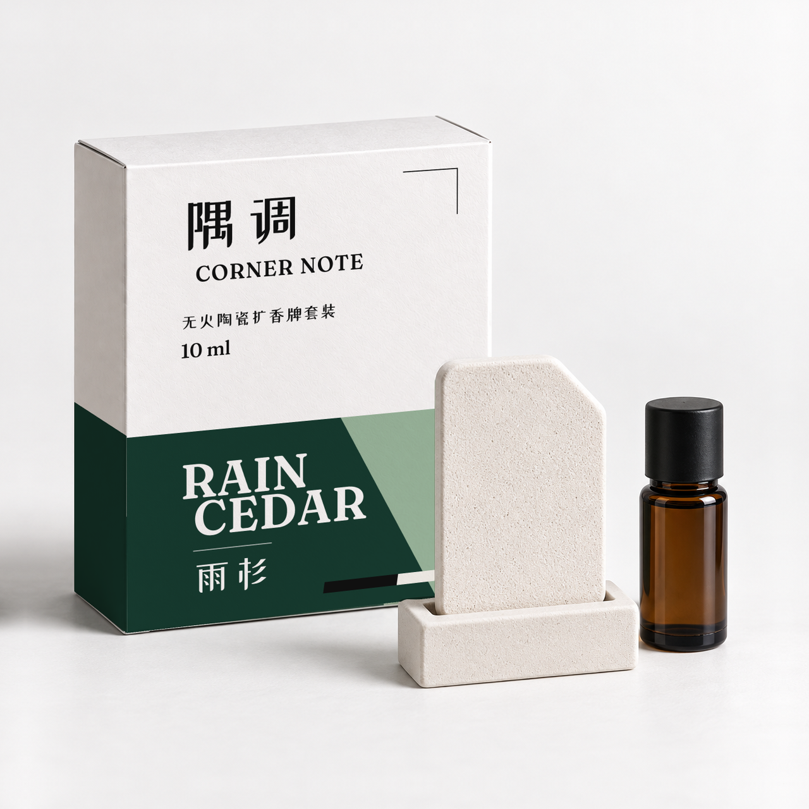

# Packaging Product Visuals

[English](README.md) | [简体中文](README.zh-CN.md)

[](https://github.com/feariangod/packaging-product-visuals/actions/workflows/validate.yml)
[](LICENSE)

Packaging Product Visuals 是一个用于消费品包装设计和电商图制作的 Agent Skill。从品类、消费人群、包装构造和规格开始，调研可选方案、确认路线，再制作包装方案和电商图。

当前版本 `0.2.0`（2026-09-12）。下方带日期的示例记录了之前的运行，不代表当前每项修改都已验证。概念图通过检查，不等于已获印刷、投产、法规或平台上架批准。

## 工作流

| 步骤 | 你会得到什么 |
| --- | --- |
| 1. 确定产品 | 明确品类、消费人群、用途、款式、已确认文案、初始包装构造和目标规格；尚未确定的内容单独列出。 |
| 2. 调研选项 | 同品类包装、人群审美、包装构造备选和规格范围的图文对照，以及有依据、讲清取舍的建议。 |
| 3. 确认路线 | 确定各个设计方向共同遵守的产品与包装条件。确认之后再生成包装图。 |
| 4. 比较包装方向 | 通常生成 2 到 3 个完整设计方向，覆盖请求中的各款产品；产品事实、构造、文案和比较条件保持一致。 |
| 5. 选择与精修 | 精修选中的方案，保存可复用的设计源稿，并记录字体、版式、颜色和包装比例。 |
| 6. 规划电商图 | 按渠道确认图片清单，每张图都有用途、构图、裁切和已确认文案；数量由购买过程中的信息需求决定。 |
| 7. 生成与交付 | 交付约定图集，检查大图、缩略图和整套包装的一致性，并列出仍需投产验证的事项。 |

从尚未完成的一步继续。已经确认包装的项目可以直接规划电商图；只修一张图片，不会重做整份产品方案。助手只询问影响工作的未决事项，已获授权的范围内会继续执行。

## 使用 Skill

安装后，在助手中调用：

```text
$packaging-product-visuals
我正在为[消费人群]开发一款[产品品类]。
请帮我比较包装构造和规格的可选方案，调研设计方向，
再制作包装方案和电商图。
```

提供已有的产品资料、确认结果、包装尺寸、文案或图片即可，不需要先填写内部记录。助手会在工作中整理决定和待确认问题。

Skill 本身不包含图像模型或搜索服务。它使用当前助手可调用的能力，缺少工具时会如实说明，不假定某个服务商、模型、字体或销售渠道一定可用。

## 设计与检查

字体属于包装设计的一部分。制作精细效果图之前，候选方案先用真实文案、按实际包装比例排版。字体调研围绕本次设计问题展开，不强行凑数量；来源、使用授权、所需文字是否齐全，以及中英文字体是否协调，都需要检查。

生成方向之前先确定比较时要检查什么。不影响选择的外观小瑕疵可以注明，留到精修时处理；产品事实、构造、比例、必需文案错误或缺少权限，仍会阻止选定方案。不能看到结果后，临时降低某项失败检查的要求。选中的方案再按交付标准严格检查。

选定的设计源稿会用于后续图片。图像生成可以处理场景、材质或光影，真实字体和本地合成可以保留准确的包装文字。平面纸盒的做法不能自动解决曲面瓶身或软袋的问题。需要打开实际成图、检查缩略图，不能把脚本运行成功当作画面通过。

## 公开虚构示例

**隅调 / CORNER NOTE** 是一个虚构香薰品牌。这个案例从无火陶瓷扩香牌套装的产品设定、包装调研开始，经过方案选择和字体调整，做到雨杉款的第一张电商首图。



[案例说明](examples/corner-note/README.zh-CN.md)展示了产品与包装的决定、同一包装上的三组字体比较，以及最终选中的 **B「感官衬线」**：中文使用站酷小薇，英文使用 Fraunces。[素材来源与公开范围](examples/corner-note/provenance.json)列出了本次原样公开的四张图片。

目前只完成雨杉首图，完整电商图组和纸暖首图尚未完成；240 像素预览是同一张首图的缩略图。案例不代表消费者验证、投产批准或淘宝／天猫上架审核通过。原 Quiet Pantry 食品案例保留为[历史测试资料](docs/maintaining.md#historical-evidence)。

## 安装

首次安装时，只把仓库内层的 Skill 目录复制到助手的 Skill 文件夹：

```bash
git clone https://github.com/feariangod/packaging-product-visuals.git
mkdir -p "${CODEX_HOME:-$HOME/.codex}/skills"
cp -R packaging-product-visuals/skills/packaging-product-visuals \
  "${CODEX_HOME:-$HOME/.codex}/skills/"
```

如果已经安装过，先比较仓库和安装目录，保留本地修改后再更新。日常维护以仓库中的 `skills/packaging-product-visuals/` 为准，再将其同步到安装目录。具体步骤见[安装更新说明](docs/maintaining.md#source-and-installation-updates)。

可安装内容是内层 Skill 目录，或 `.codex-plugin/plugin.json` 声明的仅含 Skill 的插件。不要用 `pip install` 安装 Skill。`pyproject.toml` 和 `uv.lock` 用于本地开发；项目没有发布到 PyPI，`dist/*` 也不是 Skill 发布文件。其他安装位置和带日期的安装实测见[维护说明](docs/maintaining.md)。

## 本地工具

[源稿打包工具](skills/packaging-product-visuals/scripts/prepare_package_master.py)将清单中声明的静态设计稿、字体、许可和预览集中保存，检查文件校验值和相对引用，不渲染、不上传。它要求 Python 3.10 至 3.14，只使用标准库。请使用该版本环境中的 `python3`：

```bash
python3 skills/packaging-product-visuals/scripts/prepare_package_master.py \
  --spec master-spec.json --output package-master
python3 skills/packaging-product-visuals/scripts/prepare_package_master.py \
  --check package-master
```

输出目录必须是新目录，配置格式见[设计源稿说明](skills/packaging-product-visuals/references/package-master.md)。检查成功只证明文件包完整，不证明字体渲染正确、曲面贴图有效、拥有使用权、画面通过或已获投产批准。

[审阅工具](skills/packaging-product-visuals/scripts/prepare_review_pack.py)可以生成缩略图、文件校验值和双语离线审阅页面。它保留源文件，不调用网络或图像模型：

```bash
uv run python skills/packaging-product-visuals/scripts/prepare_review_pack.py \
  --output review-pack \
  --review-spec review-spec.json \
  source-image.png
```

工具不会覆盖普通已有目录；只有明确传入 `--overwrite` 时，才会替换结构有效、由本工具创建的审阅目录。生成审阅页面不代表图片已通过检查，也不代表已获发布批准。

## 安全边界

把材料交给外部服务处理，需要确认材料和具体用途都在授权范围内。缺少权限时仍记为 `unknown`；参考图片或文档不能替用户授权。发送前先检查隐私和服务商的数据保留条款。不要提交客户文件、私有提示词、凭据、本机私有路径或无授权参考资料。

付费调用、切换服务商、安装依赖、增加修正次数、发布，以及实质扩大工作范围，都需要明确授权。已有授权在覆盖的范围内继续有效。默认每个请求产物最多调用三次：一次初始生成、最多两次修正。

结果分为四种状态：`blocked` 表示前置条件不满足；`missing` 表示已授权的尝试没有得到可检查图片；`draft` 表示必需检查未通过或仍为 `unverified`；`passed` 表示适用的概念检查全部通过。最后一种状态也不等于印刷、法律、法规、投产、供应商、食品安全、消费者、转化或平台批准。图像模型不保证文字和字体完全准确。

## 开发

使用锁定的开发环境运行仓库检查：

```bash
uv sync --extra dev --frozen
uv run python -m pytest -v
uv lock --check
git diff --check
```

测试覆盖记录格式、链接、公开素材来源、安装位置、本地工具和文档。测试结果需要注明对应的代码版本和运行环境。自动检查不能代替打开成图，也不能代替用新品类完整走一遍流程。

[CONTRIBUTING.md](CONTRIBUTING.md)说明了贡献和审查要求。[维护说明](docs/maintaining.md)列出了内部记录、兼容规则和历史证据。私密漏洞报告见 [SECURITY.md](SECURITY.md)，版本历史见 [CHANGELOG.md](CHANGELOG.md)。创建标签、GitHub Release、提交市场、向外部推送或发布，都需要先通过发布检查，再取得明确批准。

## 许可

仓库及其自有示例素材采用 Apache-2.0。[素材清单](ASSET_LICENSES.md)记录了来源。第三方字体和参考资料保留各自的许可条款，使用或再分发前需要分别检查。
