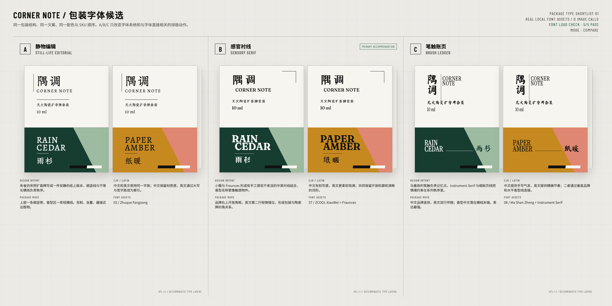
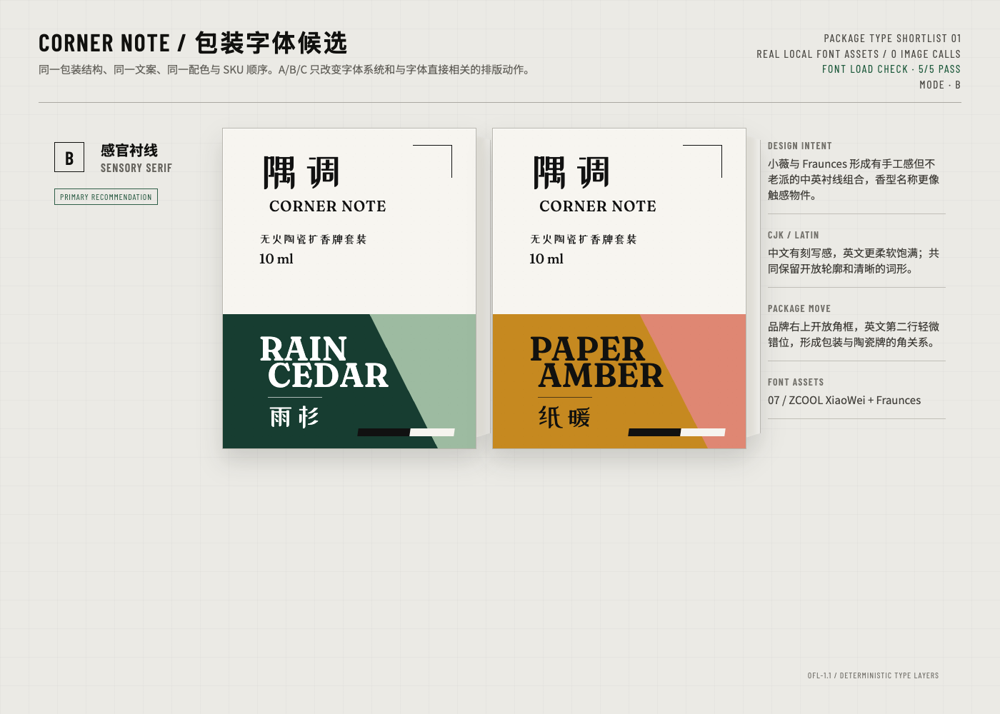
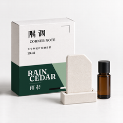

# 隅调 CORNER NOTE

[English](README.md) | [简体中文](README.zh-CN.md) | [返回 Skill](../../README.zh-CN.md)

**一个虚构香薰产品，从产品与包装的决定，做到第一张电商首图。** 这次工作发生在 2026-09-10 至 2026-09-12。本页整理其中的决定，并公开四张选定图片，不包含完整工作档案。

## 产品与包装

产品起点是一套无火陶瓷扩香牌，设想面向注重设计、用于小空间或送礼的消费者。这是工作假设，不是消费者测试得出的结论。

| 决定 | 选定的概念方案 |
| --- | --- |
| 品牌 | 隅调 / CORNER NOTE |
| 产品组成 | 一块多孔陶瓷扩香牌、一个带插槽的陶瓷底座、一瓶 10 ml 香氛油 |
| 两款香型 | 雨杉 / RAIN CEDAR、纸暖 / PAPER AMBER |
| 包装构造 | 竖式折叠纸盒、可拆香型腰封、分隔纸纤维内托 |
| 比较用尺寸 | 纸盒高 120 mm、宽 95 mm、深 46 mm；扩香牌 70 × 50 × 10 mm |

这些尺寸用于保持概念方案可比，不是供应商确认的规格，也不是印刷刀版。

## 调研与决定

1. **先比较产品和包装的选项。** 同品类调研关注陶瓷香氛器物、香氛油与器物的组合、包装呈现，以及各部件需要的容纳空间。包装比较了紧凑折叠纸盒、抽屉硬盒、器物与补充装分盒三个方案。最后选择紧凑纸盒：部件放在一套包装里，也比抽屉礼盒更紧凑。
2. **再选包装的视觉方向。** 三个初始方向沿用已确认的产品与包装条件。修正比较图的几何问题后，选中第 02 个方向「气味索引」：用两套香型配色、斜切腰封色块和小型黑白索引条组织包装。
3. **字体不合适，就回到字体上解决。** 当时的文字仍显得偏僵硬，与包装不够协调。因此重新调研字体，把三组真实字体放到相同包装比例、真实文案上比较，产品、文字内容、腰封布局和香型配色保持不变。

原同品类调研记录于 2026-09-10，参考了 [GALLIA RAE](https://galliarae.com/products/pietrina-home-fragrance-diffuser-set)、[elemense](https://elemensefragrance.com/products/diffuser_stone) 和 [FAZEEK](https://www.fazeek.com.au/products/signature-fragrance-oil-bundle-scent-stone-1) 的产品页面。它们用于了解产品形式与呈现方式，不能证明中国大陆消费者的审美偏好。本页不附带第三方参考图片。

## 字体比较

| 方案 | 中文 / 英文 | 主要差别 |
| --- | --- | --- |
| A「静物编辑」 | 朱雀仿宋 / 朱雀仿宋 | 笔画较细，更接近编辑排版的气质 |
| B「感官衬线」 | 站酷小薇 / Fraunces | 中文带刻写感，英文衬线更柔和 |
| C「笔触账页」 | 马善政毛笔楷书 / Instrument Serif | 手写感更明显 |

**最后选择 B。** 这里的 B 指字体方案，不是前面选择的包装构造。雨杉保留松绿与雾绿，纸暖保留赭黄与灰珊瑚色。

这些是包装正面设计稿的比较，不是三套新生成的实拍效果图。板上的 `5/5 PASS` 是当时五个包装字体别名的加载检查；排板说明还用了另外两个字体家族。`0 IMAGE CALLS` 只表示这次本地字体比较没有调用图像模型，不代表整个案例没有生图。字体来源见[素材清单](../../ASSET_LICENSES.md#corner-note)。

## 第一张电商首图

选中的设计稿被用于雨杉款首图，准备放在规划中的淘宝／天猫商品页。图像生成负责场景与纸盒表面修正，本地合成负责贴入真实字体排好的设计稿。本次公开直接使用已有成图，没有重新生图或修图。

首图中有四个可见物件：一个闭合纸盒、一块扩香牌、一个插槽底座、一瓶带盖琥珀色香氛油。原检查同时查看了大图和这张 240 × 240 像素预览：

生成这张图的 agent 在两个尺寸下各记录了 17 项概念检查，合计 34 项通过。这是当时的自查记录，不是独立审查，也不是平台审核。240 像素下不要求细小的产品说明全部可读。

## 做到了哪一步

概念阶段已完成产品与包装路线、两款香型的正面设计系统，以及**一张雨杉首图**。缩略图来自同一张首图，不算第二张独立交付。纸暖首图和其余电商图还没有制作。

消费者偏好、转化效果、商标、香氛表现、材料兼容性、防漏、运输保护、标签和制造工艺仍未验证。这不是已完成的商业产品，也不代表通过淘宝／天猫上架审核。

可复用的做法是：先确定产品、消费人群、包装构造和规格；针对未决问题调研；确认路线后，在相同条件下比较设计；把选中方案的字体做好，再沿用确认的设计稿制作约定的电商图。本案例展示到首图；完整图组尚未制作，其他品类仍需分别实测。

[素材来源与本次公开范围](provenance.json)列出了具体文件。这里只分享四张 PNG 和案例摘要，不包含字体文件、可编辑工作文件、原始提示词、私有记录或第三方参考图片。
